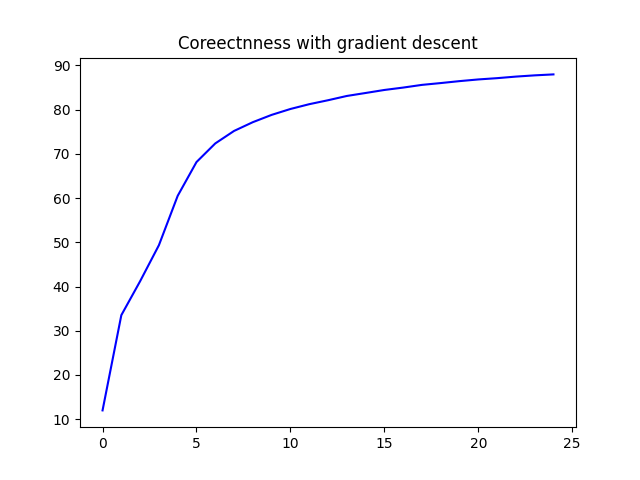

# Implementing Classification Neural Network from Scratch

The idea here is to share how to build neural network from scratch without using TensorFlow and PyTorch

## Prerequisites
1. Python

2. Numpy

3. Matplotlib


## Usage
Training the model by executing the following command:
```bash
python nn.py
```
Takes about 20s on CPU to achieve ~90% test accuracy on MNIST dataset.

## Equation 
Following is the different equation being used in training the neural network

**Forward propagation**

$$Z^{[1]} = W^{[1]} X + b^{[1]}$$

$$A^{[1]} = g_{\text{ReLU}}(Z^{[1]}))$$

$$Z^{[2]} = W^{[2]} A^{[1]} + b^{[2]}$$

$$A^{[2]} = g_{\text{softmax}}(Z^{[2]})$$

**Backward propagation**

$$dZ^{[2]} = A^{[2]} - Y$$
$$dW^{[2]} = \frac{1}{m} dZ^{[2]} A^{[1]T}$$

$$dB^{[2]} = \frac{1}{m} \Sigma {dZ^{[2]}}$$

$$dZ^{[1]} = W^{[2]T} dZ^{[2]} .* g^{[1]\prime} (z^{[1]})$$

$$dW^{[1]} = \frac{1}{m} dZ^{[1]} A^{[0]T}$$

$$dB^{[1]} = \frac{1}{m} \Sigma {dZ^{[1]}}$$

**Parameter updates**

$$W^{[2]} := W^{[2]} - \alpha dW^{[2]}$$

$$b^{[2]} := b^{[2]} - \alpha db^{[2]}$$

$$W^{[1]} := W^{[1]} - \alpha dW^{[1]}$$

$$b^{[1]} := b^{[1]} - \alpha db^{[1]}$$



### More Resources
- Building a Neural Network from Scratch
https://jonathanweisberg.org/post/A%20Neural%20Network%20from%20Scratch%20-%20Part%201/

- Mnist dataset
http://yann.lecun.com/exdb/mnist/

